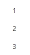
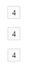

## 概念

闭包（closure）是函数式编程的一个重要概念。它指的是一个函数包含了外部作用域（enclosing scope）中的变量。当这个函数被调用时，它会记住这些变量的值，尽管变量是在函数定义的作用域之外。

闭包可以用来实现很多有用的功能：

* 延迟求值：函数的执行可以被延迟至被调用时
* 回调函数：在某个事件发生时被调用的函数
* 装饰器：用来修改函数行为的函数

## 基本陷阱

在C#中，一个较为常见的陷阱案例是在for循环中延迟求值。

例如，若有以下类设计（基于C#12语法）：

```csharp
        public sealed class ClosureBuilder(Action<Closure> builder)
        {
            public Closure Build()
            {
                var value = new Closure();
                builder.Invoke(value);
                return value;
            }
        }

        public sealed class Closure
        {
            public int Id { get; set; }

            public override string ToString() => $"{nameof(Closure)}:{Id}";
        }
```

假设我们希望“延迟”Build出3个Closure对象，Id从1到3。先给出以下代码结构：

```csharp
            var builders = new List<ClosureBuilder>();
            for (int i = 1; i <= 3; i++)
            {
                // 应该怎么做呢？
            }
            foreach (var builder in builders)
            {
                Console.WriteLine(builder.Build()); //调用Build的时候才真正创建Closure对象
            }
```

对新手读者来说，可以暂停阅读下文，花点时间思考一下for循环中应该怎么写。

***

相信有不少人第1次会写成：

```csharp
            var builders = new List<ClosureBuilder>();
            for (int i = 1; i <= 3; i++)
            {
                builders.Add(new(c => c.Id = i));
            }
            foreach (var builder in builders)
            {
                Console.WriteLine(builder.Build());
            }
```

然后就掉坑里去了……我们执行一下可以看到结果：

```log
Closure:4
Closure:4
Closure:4
```

这似乎是反直觉的，怎么所有的Closure对象Id都变成了4？

for循环的`i`是在Action（函数）之外定义的，所以这是一个典型的闭包情形。我们可以看一下编译器对这段代码的处理：

```csharp
        List<ClosureBuilder> list = new List<ClosureBuilder>();
        <>c__DisplayClass0_0 <>c__DisplayClass0_ = new <>c__DisplayClass0_0();
        <>c__DisplayClass0_.i = 1;
        while (<>c__DisplayClass0_.i <= 3)
        {
            list.Add(new ClosureBuilder(new Action<Closure>(<>c__DisplayClass0_.<M>b__0)));
            <>c__DisplayClass0_.i++;
        }
        List<ClosureBuilder>.Enumerator enumerator = list.GetEnumerator();
        try
        {
            while (enumerator.MoveNext())
            {
                Console.WriteLine(enumerator.Current.Build());
            }
        }
        finally
        {
            ((IDisposable)enumerator).Dispose();
        }
```

其中`<>c__DisplayClass0_0`是编译器自动生成的隐藏类：

```csharp
    [CompilerGenerated]
    private sealed class <>c__DisplayClass0_0
    {
        public int i;

        [System.Runtime.CompilerServices.NullableContext(1)]
        internal void <M>b__0(Closure c)
        {
            c.Id = i;
        }
    }
```

编译器先是为闭包创建了1个隐藏类并且生成了1个实例；然后我们看到在创建Builder时，实际使用的Action其实就是隐藏类的`<M>b__0`方法；而该方法给Closure的Id赋值时用的又是`<>c__DisplayClass0_0`实例的i值。

也就是说，for循环之后所有Builder，最终在创建Closure对象时，执行Action所调用的Id值，都是`<>c__DisplayClass0_0.i`——也就是循环结束后`i`的值：4。

***

要避免这个陷阱，我们需要避免对同一变量的闭包引用。对本例来说，只需要将for循环中代码改为：

```csharp
            var builders = new List<ClosureBuilder>();
            for (int i = 1; i <= 3; i++)
            {
                int x = i; // 使用新的临时变量
                builders.Add(new(c => c.Id = x));
            }
            foreach (var builder in builders)
            {
                Console.WriteLine(builder.Build());
            }
```

结果就符合预期了：

```log
Closure:1
Closure:2
Closure:3
```

我们再看一下编译器的处理。为闭包生成的隐藏类并未有变化（只是改了变量命名）：

```csharp
    [CompilerGenerated]
    private sealed class <>c__DisplayClass0_0
    {
        public int x;

        [System.Runtime.CompilerServices.NullableContext(1)]
        internal void <M>b__0(Closure c)
        {
            c.Id = x;
        }
    }
```

而循环代码则与之前迥然不同：

```csharp
        List<ClosureBuilder> list = new List<ClosureBuilder>();
        int num = 1;
        while (num <= 3)
        {
            <>c__DisplayClass0_0 <>c__DisplayClass0_ = new <>c__DisplayClass0_0();
            <>c__DisplayClass0_.x = num;
            list.Add(new ClosureBuilder(new Action<Closure>(<>c__DisplayClass0_.<M>b__0)));
            num++;
        }
        List<ClosureBuilder>.Enumerator enumerator = list.GetEnumerator();
        try
        {
            while (enumerator.MoveNext())
            {
                Console.WriteLine(enumerator.Current.Build());
            }
        }
        finally
        {
            ((IDisposable)enumerator).Dispose();
        }
```

注意到`<>c__DisplayClass0_0 <>c__DisplayClass0_ =new<>c__DisplayClass0_0();`这行的代码已经从循环外放置到了循环内，这样在创建Closure对象时为Id赋值的都是对应`<>c__DisplayClass0_0`对象的`x`值 ，即其在循环中被创建时的`i`值。

以上的例子中，我们还可以了解到闭包会产生额外的内存分配开销，因为编译器会为之生成隐藏类型及实例。相较之装箱等常见新手面试内容，闭包的开销往往容易被人忽略；但在高性能、低内存资源的需求场景下，仍需要读者对其有充分的认识。

## 隐藏陷阱

各语言的闭包话题及文章，已经很多；如果笔者于上文结束，则未免显得烂俗。

事实上，尽管一个有经验的开发者可以保证自己不会错误地使用闭包，却仍然有可能掉入闭包陷阱。因为对于一个项目的开发来说，开发者多是将某个平台或框架作为起点，对下层的了解未必面面俱到，因而在上层开发时就有可能因为使用不当，触发底层逻辑掉入闭包陷阱。

就以Blazor为例，给出以下razor页面代码：

```qml
@for (int i = 1; i <= 3; i++)
{
    <p>@i</p>
}
```

上述代码显示如下：



现在我们使用Ant Design Blazor中一个非常简单的[Tag组件](https://antblazor.com/zh-CN/components/tag)，来让数字显示得更好看些：

```qml
@for (int i = 1; i <= 3; i++)
{
    <p><Tag>@i</Tag></p>
}
```

让我们看一下效果：



**怎么会这样！？**

我相信遇到这个问题的时候，我的同事肯定对Blazor以及AntBlazor组件产生了一丝怀疑。毕竟这不符合直觉，而且一开始也不易察觉和联系到闭包陷阱。

事实上Blazor官方文档对此有[直接的说明](https://learn.microsoft.com/en-us/aspnet/core/blazor/components/#loop-variables-with-component-parameters-and-child-content)：

> Rendering components inside a for loop requires a local index variable if the incrementing loop variable is used by the component's parameters or RenderFragment child content.
>
> 如果组件的参数或RenderFragment子内容使用了递增的循环变量，则在for循环中渲染组件需要一个局部索引变量。

然而很多开发者不会通读所有Blazor官方文档，从而忽略了这一点；另外文档也只是含糊地告诉我们怎么做但没有说清为什么，读者很难有一个简明扼要的感受。

***

要理解上述的问题，首先要了解Blazor对razor页面代码的处理机制：本质上razor代码会有一个源生成器（Source Generator）将其编译成C#代码，内容则主要是重写（override）组件（或页面）构建渲染树的方法（BuildRenderTree）。

在Blazor项目`.csproj`文件中增加`<EmitCompilerGeneratedFiles>true</EmitCompilerGeneratedFiles>`，我们就可以`在obj\Debug\net8.0\generated\Microsoft.NET.Sdk.Razor.SourceGenerators\Microsoft.NET.Sdk.Razor.SourceGenerators.RazorSourceGenerator`目录下看到源生成器在编译期根据razor代码生成的C#代码。

对最开始的`<p>@i</p> 代码`，它被编译为：

```csharp
        protected override void BuildRenderTree(global::Microsoft.AspNetCore.Components.Rendering.RenderTreeBuilder __builder)
        {
            __builder.OpenComponent<global::Microsoft.AspNetCore.Components.Web.PageTitle>(0);
            __builder.AddAttribute(1, "ChildContent", (global::Microsoft.AspNetCore.Components.RenderFragment)((__builder2) => {
                __builder2.AddContent(2, "Counter");
            }
            ));
            __builder.CloseComponent();
#nullable restore
#line 27 "G:\CodeRepos\demos\BlazorWasmTest\BlazorWasmTest\Pages\Counter.razor"
 for (int i = 1; i <= 3; i++)
{
    

#line default
#line hidden
#nullable disable
            __builder.OpenElement(3, "p");
#nullable restore
#line (30,9)-(30,10) 24 "G:\CodeRepos\demos\BlazorWasmTest\BlazorWasmTest\Pages\Counter.razor"
__builder.AddContent(4, i);

#line default
#line hidden
#nullable disable
            __builder.CloseElement();
#nullable restore
#line 31 "G:\CodeRepos\demos\BlazorWasmTest\BlazorWasmTest\Pages\Counter.razor"
}

#line default
#line hidden
#nullable disable
        }
```

读者不必关注`#`开头的编译指令，只要关注for循环内的代码。 让我们对比`<p><Tag>@i</Tag></p>`生成代码中的for循环部分（删除无关的行及指令）：

```csharp
  for (int i = 1; i <= 3; i++)
{
            __builder.OpenElement(3, "p");
            __builder.OpenComponent<global::AntDesign.Tag>(4);
            __builder.AddAttribute(5, "ChildContent", (global::Microsoft.AspNetCore.Components.RenderFragment)((__builder2) => {
__builder2.AddContent(6, i);
            }
            ));
            __builder.CloseComponent();
            __builder.CloseElement();
}
```

可以注意到前者p标签是一个Element（元素），因此for循环中就是简单的：

```csharp
__builder.AddContent(4, i);
```

而后者Tag本身就是一个Component（组件），`@i`是作为子内容呈现的。因此for循环中`i`是放入一个委托传递给Tag组件的ChildContent：

```csharp
__builder.AddAttribute(5, "ChildContent", (global::Microsoft.AspNetCore.Components.RenderFragment)((__builder2) => 
{
    __builder2.AddContent(6, i);
}
```

哦嚯，这不就是基本的闭包陷阱吗？

理解到这里，也就知道怎么改了：

```qml
@for (int i = 1; i <= 3; i++)
{
    var x = i;
    <p><Tag>@x</Tag></p>
}
```

看下效果：


类似地，此时生成的关键C#代码如下：

```csharp
 for (int i = 1; i <= 3; i++)
{
    var x = i;
            __builder.OpenElement(3, "p");
            __builder.OpenComponent<global::AntDesign.Tag>(4);
            __builder.AddAttribute(5, "ChildContent", (global::Microsoft.AspNetCore.Components.RenderFragment)((__builder2) => {
__builder2.AddContent(6, x);
}
            ));
            __builder.CloseComponent();
            __builder.CloseElement();
}
```

**是不是还是熟悉的配方，熟悉的味道？**
