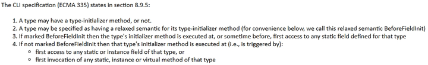

“上古时代”，人们粗糙地将编程语言分为解释型语言和编译型语言，前者对代码的编写顺序有着较为严格的要求。但事实上随着编译器和JIT技术的发展，这样的分类早已过时。对C#这样的老牌编译型语言来说，不小心没写好代码顺序，也是会踩坑的！

本文将描述一个简化过后的场景，并介绍一些值得注意的“冷知识”。闲言少叙，先看如下代码：

```csharp
public class KengStatic
{
    private static readonly List<int> _nums = InitNumbers();

    private static readonly Random Rand = Random.Shared;

    public static int Get(int index) => _nums[index];

    private static List<int> InitNumbers()
        => [.. Enumerable.Repeat(100, 10).Select(p => Rand.Next(p))];
}
```

如果读者您未看出这样的代码有何问题，不妨自己在控制台中调用试试：`Console.WriteLine(KengStatic.Get(0))`。您将获得1个`System.NullReferenceException`异常；而在实际工程中，该异常还可能被包裹在`TypeInitializationException`异常内部，从而让人更加迷茫。

原因也非常简单，就是Rand字段的初始化代码放在了错误的位置。因为_nums字段的初始化依赖Rand的初始化，所以需要调换一下代码顺序，改成：

```csharp
public class KengStatic
{
    private static readonly Random Rand = Random.Shared;

    private static readonly List<int> _nums = InitNumbers();

    public static int Get(int index) => _nums[index];

    private static List<int> InitNumbers()
        => [.. Enumerable.Repeat(100, 10).Select(p => Rand.Next(p))];
}
```

运行正常。可以看到运行期间，静态字段默认在初始化时，会按照代码编写的顺序依次执行。因此，我们需要确保被依赖的字段写在前，而依赖其他字段的写在后。

当然，会有读者轻蔑一笑：写个静态构造函数在里面初始化不就得了？

```csharp
public class KengStatic
{
    private static readonly List<int> _nums;

    private static readonly Random Rand;

    static KengStatic()
    {
        Rand = Random.Shared;
        _nums = InitNumbers();
    }

    public static int Get(int index) => _nums[index];

    private static List<int> InitNumbers()
        => [.. Enumerable.Repeat(100, 10).Select(p => Rand.Next(p))];
}
```

的确，有了静态构造函数，我们就不必在乎字段声明的顺序，而是在内部按照字段初始化的顺序编写赋值代码。但是魔鬼总是藏在细节中，当我们这么做的时，至少需要知道：显式声明静态构造函数的代价是什么？

我们先来查看没有静态构造函数且能正常执行的代码部分IL：

```gradle
.class public auto ansi beforefieldinit KengStatic
    extends [System.Runtime]System.Object
{
   //...
}
```

可以看到在类KengStatic上标记了一个关键词：`beforefieldinit`。接着换成显式声明静态构造函数的代码IL：

```gradle
.class public auto ansi KengStatic
    extends [System.Runtime]System.Object
{
   //...
}
```

对比之下，很容易注意到`beforefieldinit`这个关键词消失了。 它是干什么的呢？
关于`beforefieldinit`，网上有不少博客都“转译”或“借鉴”了《C# in depth》的章节“C# and beforefieldinit”（此链接访问可能不稳定）。

书中介绍了有无beforefieldinit的不同：

* 若有标记，则类型初始化方法可能在第一次访问静态字段时，或之前，执行。
* 若无标记，则类型初始化方法严格在第一次访问静态字段或方法时候执行。

原书关键片段截图如下：



其实官方文档对它们的区别，有着更精准和简洁的描述，只是位置有些刁钻——在[《TypeAttributes Enum》](https://learn.microsoft.com/zh-cn/dotnet/api/system.reflection.typeattributes#fields)文档的表格中，`BeforeFieldInit`被描述为：“指定调用静态方法时不强制系统初始化类型”（"Specifies that calling static methods of the type does not force the system to initialize the type."）。

综上所述，是否显式声明静态构造函数，会影响类型的加载时机。如果我们不显式声明静态构造函数，那么CLR可以自己决定何时初始化类型，尤其是在觉得合适的情形下提前初始化类型；反之，CLR只会在静态类被初次使用时，才会初始化该类型。因此，声明了静态构造函数，就等于约束了CLR的行为，限制了运行时优化。

比如执行某个循环，循环内首次使用了某个类的某个静态字段：若未显式声明静态构造函数，CLR可能已经在自己觉得恰当的时机提前初始化了类型，那么循环时就不必再检查类型是否初始化了；反之，CLR则被强制在首次循环时初始化类型，并在之后的循环中依然检查类型是否初始化，逻辑类似于如下伪代码：

```csharp
do
{
    if(!CheckTypeInitialized())
    {
        // call type's initializer method
    }
}
while(condition);
```

从而对性能产生了影响，这样的影响大多时候微乎其微，但也有可能导致可测量的性能回退。

在官方的《C#编程指导》文档“Static Constructors”一节[Remarks](https://learn.microsoft.com/en-us/dotnet/csharp/programming-guide/classes-and-structs/static-constructors)中，描述了静态构造函数的基本要点。其中包括：

> * 如果静态构造函数引发异常，运行时不会再次调用该函数，并且类型在应用程序域的生存期内会保持未初始化状态。 大多数情况下，当静态构造函数无法实例化一个类型时，或者当静态构造函数中发生未经处理的异常时，将引发 TypeInitializationException 异常。 对于未在源代码中显式定义的静态构造函数，故障排除可能需要检查中间语言 (IL) 代码。
> * 静态构造函数的存在将防止添加 BeforeFieldInit 类型属性。 这将限制运行时优化。
> * 声明为 static readonly 的字段只能在其声明时或在静态构造函数中分配。 如果不需要显式静态构造函数，请在声明时初始化静态字段，而不是通过静态构造函数，以实现更好的运行时优化。

由此可见，从CLR友好的角度说，还是更建议不声明静态构造函数，而是注意好字段代码的顺序，来跳过这个坑；亦可见得，为了让不同水平的开发者都能写好代码，官方文档操碎了心，哈哈哈。
