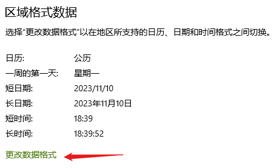

If you are using Windows 10/11, first check the date format in the bottom right corner. Most people should be the same as me:


Now look at the following very common line of code:

```csharp
new DateTime(2023, 11, 10).ToString("yyyy/MM/dd")
```

What is the result? `2023/11/10`, hmm... no problem.

Now open the "Date and Time" settings, then go to "Date, Time, and Region Format Settings" and change the date format:



Then change the "Short Date Format" from a slash to a dash:


Now look again at `new DateTime(2023, 11, 10).ToString("yyyy/MM/dd")`, its result is...`2023-11-10`！

What's going on? `yyyy/MM/dd` has already specified the string format of DateTime, right? How is it related to system settings?! A colleague encountered this issue, which was very confusing.

Most .NET developers may not encounter projects that require careful consideration of cultural differences, although many people know that date formats vary by culture. This leads many people to never encounter this issue under the default date format settings of a Chinese system. Even I, just learned that——The `/` in `yyyy/MM/dd` is just a separator between year, month, and day, and does not participate in the generation of the DateTime string format; what actually participates in the string format generation is actually the `IFormatProvider` in `DateTime.ToString (string? format, IFormatProvider? provider)`!

```csharp
    public interface IFormatProvider
    {
        object? GetFormat(Type? formatType);
    }
```

Therefore, if we want to generate `2023/11/10` as expected, we need to specify `IFormatProvider`:

```csharp
new DateTime(2023, 11, 10).ToString("yyyy/MM/dd", System.Globalization.DateTimeFormatInfo.InvariantInfo)
```

Or

```csharp
new DateTime(2023, 11, 10).ToString("yyyy/MM/dd", System.Globalization.CultureInfo.InvariantCulture)
```

Here, the actual effective separator is the [DateTimeFormatInfo.DateSeparator](https://learn.microsoft.com/zh-cn/dotnet/api/system.globalization.datetimeformatinfo.dateseparator)property! Also, the former is more recommended in usage because in this scenario, the latter is just a layer of encapsulation of the former.

Another solution is to write the code as follows:

```csharp
new DateTime(2023, 11, 10).ToString("yyyy'/'MM'/'dd")
```

Then `/` will always be used as the date separator. Why? The [official documentation](https://learn.microsoft.com/zh-cn/dotnet/standard/base-types/custom-date-and-time-format-strings#date-and-time-separator-specifiers) says so!

nterestingly, just at the end of September this year, someone else fell into this pit: [dotnet/runtime#issue 92707](https://github.com/dotnet/runtime/issues/92707)。One guy's reply there speaks for me, so I'll end with it:

> I didn't know this for years of development and I believe I'm not alone. I think it's worth to add a bold tip at the beginning of the docs ofDateTime.ToString(String).
