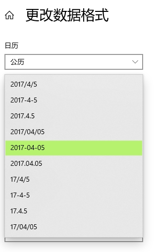

如果读者您在用Win 10/11的话，先看看右下角的时间格式，大多数人应该和我一样：


现在看下面这一行特别常见的代码：

```csharp
new DateTime(2023, 11, 10).ToString("yyyy/MM/dd")
```

结果是什么呢？`2023/11/10` ，嗯……没问题。

现在打开“日期和时间”设置，然后在下方进入“日期、时间和区域格式设置”，更改数据格式：


然后将“短日期格式”由斜杠改为横杠：



现在再看一下`new DateTime(2023, 11, 10).ToString("yyyy/MM/dd")`，它的结果是……`2023-11-10`！

怎么回事？`yyyy/MM/dd`不是已经指定DateTime的字符串格式了吗？怎么还会跟系统设置有关！？在同事的电脑上，就遇到了这样的问题，让人很困惑。

大部分.NET开发者可能接触不到需要仔细考虑文化区域差异的项目，尽管很多人都知道不同文化区域下的时间格式是不同的。这导致很多人其实在中文系统默认的时间格式配置下，根本就遇不上这样的问题。就连我自己，也是才了解到——
`yyyy/MM/dd`里的`/`，只是区分年月日的分隔符，并不参与到DateTime字符串格式的生成；而真正参与字符串格式生成的其实是`DateTime.ToString (string? format, IFormatProvider? provider)`里的`IFormatProvider`!

```csharp
    public interface IFormatProvider
    {
        object? GetFormat(Type? formatType);
    }
```

因此，如果我们希望按预期生成`2023/11/10`， 则需要明确`IFormatProvider`:

```csharp
new DateTime(2023, 11, 10).ToString("yyyy/MM/dd", System.Globalization.DateTimeFormatInfo.InvariantInfo)
```

或

```csharp
new DateTime(2023, 11, 10).ToString("yyyy/MM/dd", System.Globalization.CultureInfo.InvariantCulture)
```

这里真正生效的分隔符是[DateTimeFormatInfo.DateSeparator](https://learn.microsoft.com/zh-cn/dotnet/api/system.globalization.datetimeformatinfo.dateseparator)属性！另外在使用上更推荐前者，因为该场景下后者只是前者的一层封装。

还有一种方案则是将代码写成：

```csharp
new DateTime(2023, 11, 10).ToString("yyyy'/'MM'/'dd")
```

那么将始终将/用作日期分隔符。 您问我为什么？[官方文档](https://learn.microsoft.com/zh-cn/dotnet/standard/base-types/custom-date-and-time-format-strings#date-and-time-separator-specifiers)这么说的！

有趣的是，就在今年9月底，也有人踩了这个坑：[dotnet/runtime#issue 92707](https://github.com/dotnet/runtime/issues/92707)。其中有个哥们儿的回复说出了我的心声，就以它为结尾吧：

> I didn't know this for years of development and I believe I'm not alone. I think it's worth to add a bold tip at the beginning of the docs ofDateTime.ToString(String).
>
> 在我开发生涯的很多年里我都不知道这个，我相信不只有我一个人。我认为值得在DateTime.ToString的文档开头添加一个粗体提示。
