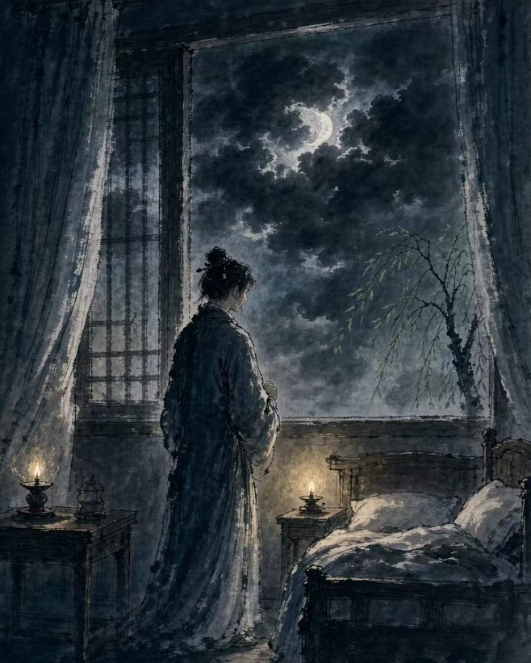

## Source Text

永夜牵情枕难眠，

沉云卷户月无弦。

再借清风寻旧梦，

疏柳依依似华年。

## AI Translation

*Please translate my creation into an English poem.*

Longing steals my sleep; I rise to meet the night.

Low clouds roll at the pane—the crescent lost to sight.

I send the clear wind forth to chase an olden dream,

Loose willows sway, as in youth’s fading gleam.

## AI Appreciation

*Within 400 words, provide an appreciation and analysis of my creation in English.*

> The poem opens with "永夜牵情枕难眠" (Endless night, love tugs—the pillow denies sleep), establishing a tension between the vastness of time and the confinement of the bed. The verb "牵" (tug) is pivotal; unlike sharper words for heartbreak, it suggests a persistent, gentle pulling of the heartstrings, portraying insomnia not as a violent agitation, but as a quiet, inescapable surrender to longing.
>
> In the second line, "沉云卷户月无弦" (Sinking clouds roll at the casement; the moon lacks its string), the perspective shifts outward. The imagery is strikingly tactile: heavy clouds seem to crash against the window frame ("卷户"), creating a sense of oppressive weight. The phrase "月无弦" (moon without a string) operates on two levels—it describes the obscured crescent moon while metaphorically silencing the music of the past, turning the natural scene into a mirror of emotional deprivation.
>
> The third line, "再借清风寻旧梦" (Again, I borrow the clear breeze to seek an old dream), marks a turn from passivity to action. Unable to traverse time physically, the speaker "borrows" the intangible wind as a proxy for the soul. This act of sending forth the breeze reflects a classical poetic trope where nature is conscripted to fulfill human desires, highlighting the delicate interplay between helplessness and hope.
>
> Finally, "疏柳依依似华年" (Slender willows lean—as in the prime of youth) closes the poem with a vision of fading elegance. The "leaning" willows echo the "tugging" emotions of the opening line. By comparing these trees to "华年" (the splendor of youth), the poet creates a poignant contrast: the willows remain graceful, but the years they evoke are irrevocably gone. The "resemblance" implied by "似" (like/seem) underscores the central tragedy—the past is visible, yet forever out of reach, much like the hidden moon behind the clouds.