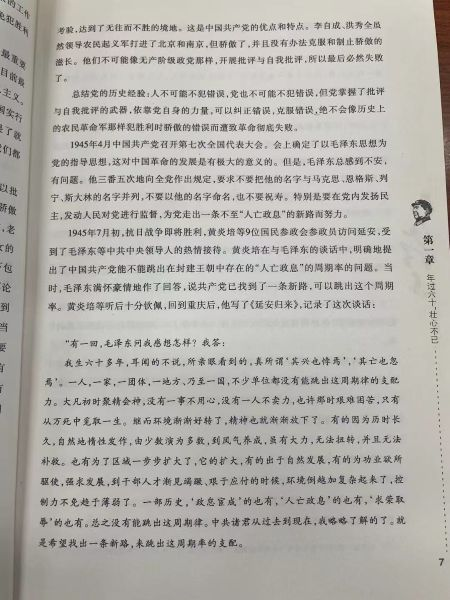

## Source Text

贪风痴狂云嗔楼，六朝私计何时休。

平生尽是无能事，纵饮千杯恁咽愁！

## AI Translation

*Please translate my creation into an English poem.*

* Greed and madness whirl around the tower of clouds, when will the selfish schemes of six dynasties cease?

* A life filled with futile deeds, even a thousand cups of wine cannot quench the sorrow that chokes!

## AI Appreciation

*Within 400 words, provide an appreciation and analysis of my creation in English.*

> This poem, written in classical Chinese style, conveys a deep sense of historical reflection and personal sentiment. It begins with a vivid depiction of a tumultuous and chaotic world filled with greed and madness, symbolized by the "cloud-anger tower". The line "when will the selfish schemes of six dynasties cease?" reflects the poet's critique of the relentless power struggles and personal ambitions that have marred history.
>
>The third line, "A life filled with futile deeds," expresses the poet's sense of powerlessness and self-reproach, feeling insignificant in the face of grand historical forces. The final line, "even a thousand cups of wine cannot quench the sorrow that chokes," uses the image of drowning sorrows in alcohol to convey the poet's helplessness and melancholy.
>
>The poem juxtaposes the grand sweep of history with the poet's personal feelings, offering a poignant commentary on the human condition and the desire for peace and meaning amidst turmoil. It invites readers to ponder the cyclical nature of history and the individual's place within it, while also resonating with universal themes of struggle and the search for solace.
