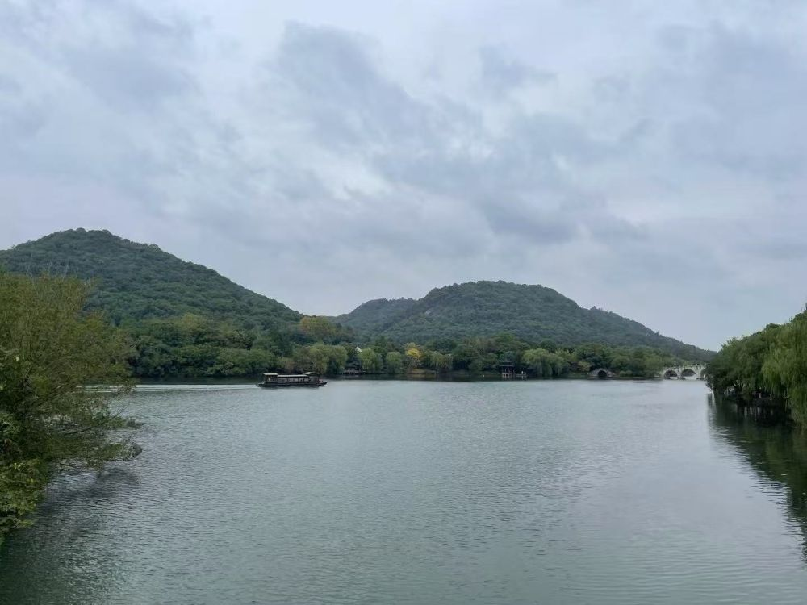

## Source Text

手织密雨覆纤柳，眼化飞鹭剪寒烟。

斜望青峰画青云，远瞰湖船枕湖天。

狮子山北尝苦胆，潇湘桥左卧薪眠。

好景最在阑珊处，退后亦可成向前。

## AI Translation

*Please translate my creation into an English poem.*

* Weaving fine rain o'er slender willows, eyes like egrets cut through the cold mist.

* Gazing askance at green peaks painting the azure clouds, distant boats rest on the lake's horizon.

* North of Lion Hill, tasting the gall, left of Xiaoxiang Bridge, lying in wait with bated breath.

* The finest view lies in the dim and distant, stepping back can also lead to moving forward.

## AI Appreciation

*Within 400 words, provide an appreciation and analysis of my creation in English.*

> This poem is a rich tapestry of imagery and philosophy, blending natural beauty with profound personal reflection. It opens with a vivid scene of fine rain weaving over slender willows, creating a serene and delicate atmosphere. The poet then shifts perspective, likening themselves to a flying egret cutting through the cold mist, symbolizing a sense of freedom and transcendence. The imagery of gazing at distant peaks and boats resting on the lake’s horizon further enhances the sense of tranquility and contemplation.
>
> The poem takes a more introspective turn with references to historical resilience, such as "tasting the gall" and "lying in wait with bated breath," which evoke the spirit of perseverance and endurance. These lines draw on the Chinese idiom "sleeping on brushwood and tasting gall," signifying the poet’s past struggles and determination.
>
> The final couplet offers a philosophical conclusion: the finest moments are often found in the most subtle and quiet places, and even stepping back can pave the way forward. This reflects a deep appreciation for the understated and a hopeful outlook on overcoming challenges.
>
> Overall, the poem masterfully intertwines natural beauty with personal and philosophical depth, inviting readers to appreciate both the external world and the inner journey of resilience and optimism.
