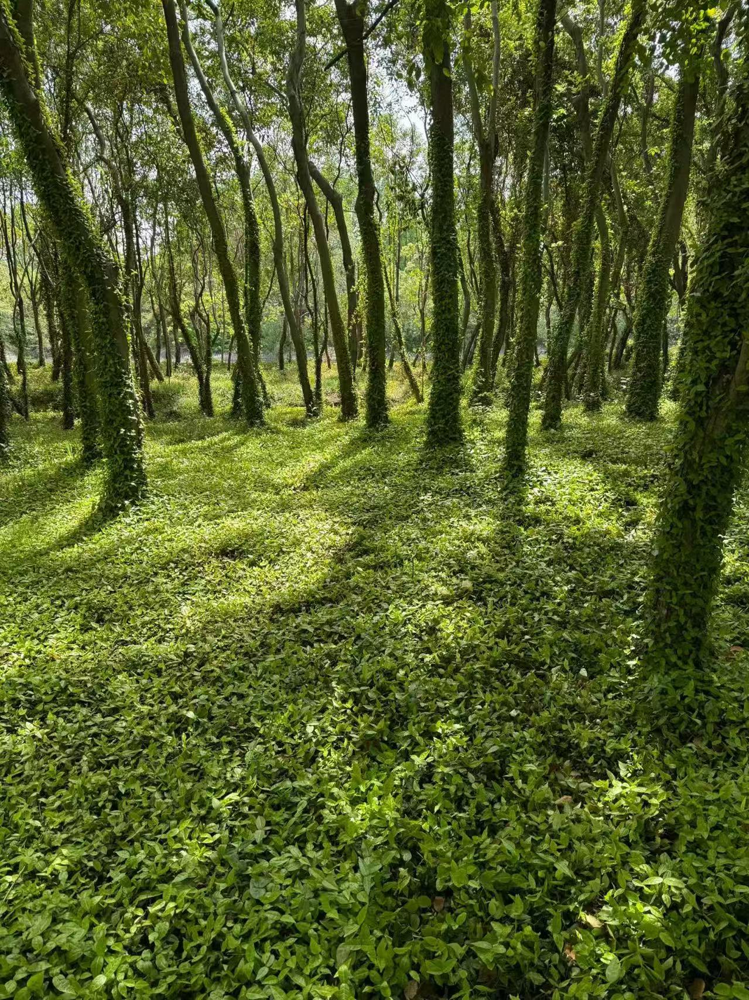
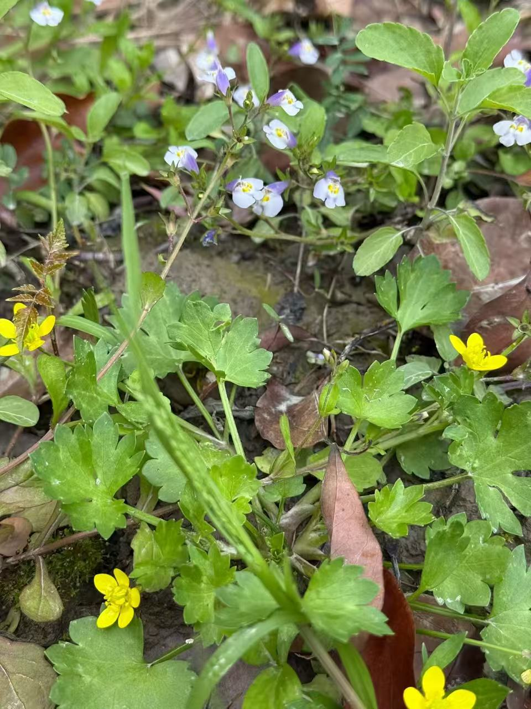

## Source Text

芳晖普照画繁春，正是风暖太平时。

忽见石龙盘苍木，欲附高枝与天齐。

不须深根争雨露，可怜野草无存隙！

假使凌云皆此辈，何容百花显英姿。

 

## AI Translation

*Please translate my creation into an English poem.*

* Warm sunbeams gild spring’s lush, resplendent scene,
  Soft breezes blow—these halcyon days serene.
  
* Suddenly, I spy the Stone Dragon coil
  Around the aged trunk, straining skyward to toil.
  
* No need to root deep for rain or dew,
  While wild herbs starve with no space to grew!
  
* If all who soar were merely such as these,
  Where would blossoms show their grace and ease?

## AI Appreciation

*Within 400 words, provide an appreciation and analysis of my creation in English.*

> This poem is a masterclass in allegorical nature writing, transforming a simple observation of flora into a sharp social critique. The author employs the Stone Dragon Vine—a parasitic plant known in Chinese botany as shilongteng—as a sustained metaphor for opportunists who ascend through leverage rather than merit.
> 
> The opening couplet establishes a classic idyllic scene: “Warm sunbeams gild spring’s lush, resplendent scene.” By invoking “halcyon days,” the poet paints a picture of stability and peace. This serves a crucial strategic purpose; it sets up a sense of complacency. The harmony of the “flourishing spring” makes the subsequent discovery of the vine all the more jarring. It suggests that during times of peace, hidden threats often go unnoticed until they have already taken hold.
> 
> The pivot occurs in the third line: “Suddenly, I spy the Stone Dragon coil.” The verb “coil” immediately evokes a sense of constriction and stealth. Unlike a tree that grows from a seed with effort, this vine “strains skyward” by wrapping itself around the “aged trunk.” Here, the contrast between the vine’s ambition (“to toil”) and its lack of substance is striking. It seeks the heights of heaven not through growth, but through attachment.
> 
> The most biting irony is found in the fifth and sixth lines. The vine boasts, “No need to root deep for rain or dew,” highlighting its laziness and arrogance. Its success directly correlates with the suffering of others: “wild herbs starve with no space to grew.” The word “可怜” (pitiable) conveys a sense of tragedy for the grassroots entities crushed by the climber’s greed. This reflects a timeless political reality—that the rise of the unprincipled often occurs at the expense of the vulnerable.
> 
> Finally, the concluding couplet elevates the poem from a nature sketch to a philosophical warning: “If all who soar were merely such as these, / Where would blossoms show their grace and ease?” The imagery of “blossoms” (百花) symbolizes genuine talent, diversity, and beauty. The poet warns that if a system rewards only those who cling to power without integrity, there will be no room left for authentic excellence.
> 
> Stylistically, the poem adheres to classical regulated verse (律诗) conventions, with a clear parallel structure in the middle couplets. The language is accessible yet rich in symbolism. For the Western reader, it resonates with Aesop’s fables, specifically “The Vine and the Oak,” but carries a uniquely East Asian introspective depth regarding social harmony. It is a poignant reminder that true greatness requires deep roots, and that a garden—or a society—choked by parasites cannot sustain its beauty.
