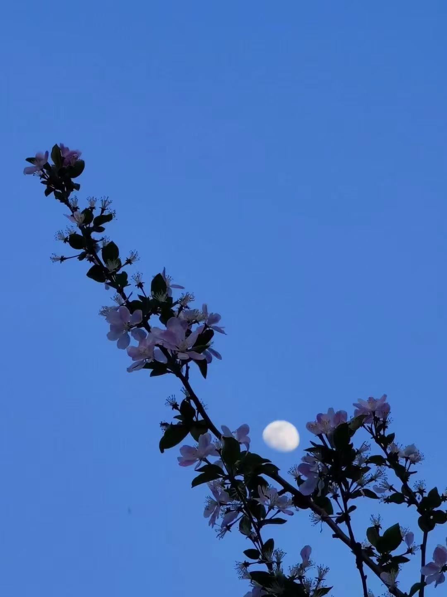

## Source Text

苏州河畔烟绕柳，黄埔江上风戏鸥。

旧忆徒让眉间皱，春色不解人心愁。

昔道年年花依旧，今朝却难故地游。

独剩桃花系残雨，一轮明月挂枝头。

## AI Translation

*Please translate my creation into an English poem.*

* By the Suzhou River, mist entwines the willows,  
  On the Huangpu River, the wind plays with gulls.  

* Old memories only furrow the brow,  
  Spring’s beauty fails to soothe the heart’s sorrow.  

* Once said that every year the flowers remain the same,  
  Today, it’s hard to visit the old places again.  

* Only peach blossoms are left, tied to the lingering rain,  
  A bright full moon hangs from the branches.

## AI Appreciation

*Within 400 words, provide an appreciation and analysis of my creation in English.*

> This poem is a delicate and evocative work that blends natural beauty with deep emotional reflection. It paints a vivid picture of the Suzhou River, where mist swirls around the willows, and the Huangpu River, where the wind playfully dances with seagulls. These images create a serene yet dynamic scene, capturing the gentle movement of nature.
>
> The poem then shifts to a more introspective tone, with memories that only serve to furrow the brow and a spring that cannot alleviate the heart’s sorrow. This contrast between the unchanging beauty of nature and the transient nature of human emotions is a central theme. The past is remembered through the recurring image of flowers, but the present is marked by the difficulty of revisiting old places, suggesting a sense of loss and change.
>
> The final lines, with peach blossoms tied to the lingering rain and a full moon hanging from the branches, offer a poignant conclusion. These images evoke a sense of lingering beauty and timelessness, even as the poem acknowledges the passage of time and the impermanence of human experiences.
>
> Overall, this poem beautifully captures the interplay between the enduring beauty of nature and the fleeting nature of human emotions. It invites readers to reflect on their own memories and the passage of time, making it a deeply moving and thought-provoking piece.
