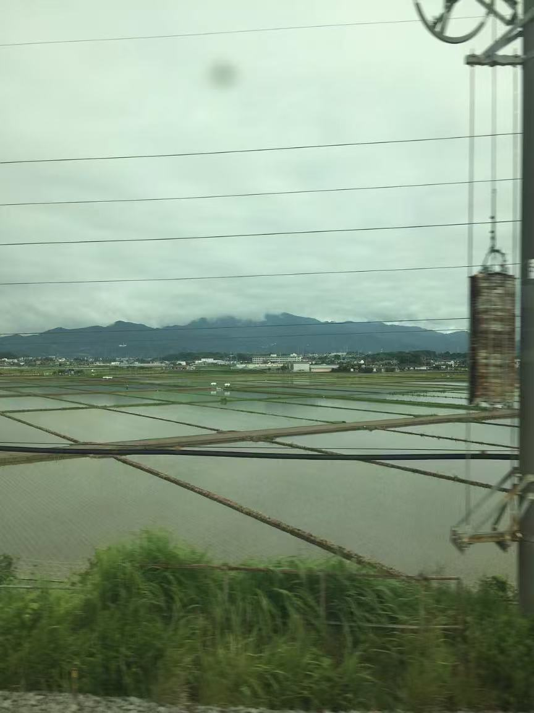

## Source Text

遥闻君子成名久，今过门前思睹颜。

孰晓群峦齐障目，风采尽入雾中埋。

三顾茅庐天下计，好事多磨犹可期。

他日借得盘古斧，斩得云开还复来！

## AI Translation

*Please translate my creation into an English poem.*

* Long have I heard of the noble one’s fame,  
  Now passing by, I wish to behold his face.  

* Who knew the mountains would block my view,  
  All his charm buried deep in the mist.  

* Thrice I’ve sought wisdom at the thatched door,  
  Good things come with trials, but hope remains.  

* One day I’ll borrow Pangu’s mighty axe,  
  To cut through the clouds and come again.

## AI Appreciation

*Within 400 words, provide an appreciation and analysis of my creation in English.*

> This poem, titled "Passing by Mount Fuji," is a powerful and evocative work that captures both anticipation and determination. It begins with a sense of long-standing admiration and a desire to finally witness something grand.
>
> The first line, "遥闻君子成名久，今过门前思睹颜," sets the stage with a tone of reverence and longing. The phrase "君子成名久" (the gentleman's fame has long been heard) suggests a deep respect for the subject, while "今过门前思睹颜" (now passing by, thinking of seeing his face) conveys a strong desire to finally meet or see something that has been admired from afar. This line creates a sense of anticipation and excitement.
>
> The second line, "孰晓群峦齐障目，风采尽入雾中埋," introduces an obstacle. "孰晓群峦齐障目" (who knew that the mountains would block the view) expresses the frustration of being unable to see clearly, while "风采尽入雾中埋" (all the charm buried in the fog) adds a sense of mystery and loss. This line highlights the challenges that can obscure what we long to see.
>
> The third line, "三顾茅庐天下计，好事多磨犹可期," draws on a historical allusion. "三顾茅庐" (visiting the thatched cottage three times) refers to the story of Liu Bei visiting Zhuge Liang, emphasizing persistence and the importance of seeking wisdom. "好事多磨犹可期" (good things come with trials, but still can be hoped for) reinforces the idea that despite difficulties, success is still possible.
>
> The final line, "他日借得盘古斧，斩得云开还复来!" is a declaration of determination. "他日借得盘古斧" (one day, borrowing the axe of Pangu) evokes the mythological image of Pangu, the creator of the world, and his powerful axe. "斩得云开还复来" (cutting through the clouds to come again) expresses a strong will to overcome obstacles and achieve the goal. This line leaves the reader with a sense of hope and resolve.
>
> Overall, this poem is a compelling narrative of admiration, frustration, persistence, and determination. It uses vivid imagery and historical allusions to convey a message of perseverance in the face of challenges. The poem invites readers to reflect on their own journeys and the obstacles they face, while encouraging them to remain hopeful and determined.
